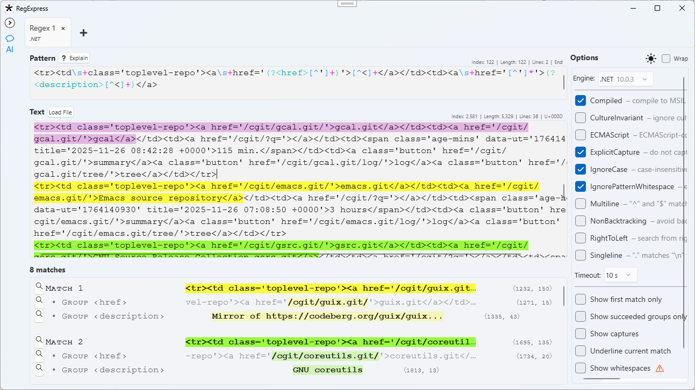
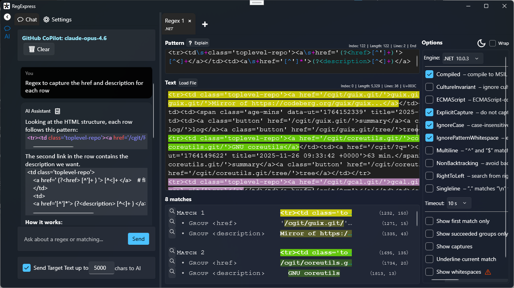

# RegExpress

A comprehensive regular expression testing application with implementations of 25+ of the top Regex engines across dozens of languages.  Integrated (optional) AI assist for creating and understanding patterns.

Made in Visual Studio 2026 using C#, C++, WPF, .NET 10.

## This Fork
This fork of the original [RegExpress project](https://github.com/Viorel/RegExpress) includes several additional updates.  While I have submitted a PR for the several currently the original author [has commented](https://github.com/Viorel/RegExpress/pull/3#issuecomment-3702954971) they prefer to keep this separate.  This project has taken an enormous about of time and skill to create and the original author has done 99% of that amazing work.

### Enhancements to the original project
* **AI Assistant Pane** - Integrated AI companion throuhg [PilotAIAssistantControl](https://github.com/MitchCapper/PilotAIAssistantControl) that can both generate and explain patterns. Supports GitHub Copilot (auto-discovers VS Code tokens), OpenAI, Google Gemini, Anthropic Claude, and custom/local endpoints like Ollama.
* **Fluent Theme** - Modern .NET fluent theme styling with proper DPI awareness.
* **Dark Mode Support** - Full dark mode theming that respects system preferences or can be manually controlled.
* **Inspect Capture/Group** - Right-click a match to inspect captures and groups in a new tab.
* **HtmlAgilityPack Engine** - Added XPath and CSS selector support for HTML parsing.

## Regex Engines
It includes the following Regular Expression engines:

* **[C# Regex](https://learn.microsoft.com/en-us/dotnet/api/system.text.regularexpressions.regex?view=net-10.0)** class from .NET 10 (Modern).
* **[C# Regex](https://learn.microsoft.com/en-us/dotnet/api/system.text.regularexpressions.regex?view=netframework-4.8)** class from .NET Framework 4.8.
* **[wregex](https://docs.microsoft.com/en-us/cpp/standard-library/regex)** class from C++ Standard Template Library (MSVC and GCC) and the [SRELL](https://www.akenotsuki.com/misc/srell/en/) variation.
* **[Boost.Regex](https://www.boost.org/doc/libs/1_89_0/libs/regex/doc/html/index.html)** from Boost C++ Libraries 1.89.0.
* **[PCRE2](https://github.com/PCRE2Project/pcre2)** Open Source Regex Library 10.47 (in C).
* **[RE2](https://github.com/google/re2)** Library 2025-08-12 from Google (in C++).
* **[Oniguruma](https://github.com/kkos/oniguruma)** Regular Expression Library 6.9.10 (in C++).
* **[SubReg](https://github.com/mattbucknall/subreg)** 2024-08-11 (in C).
* **JavaScript [RegExp](https://developer.mozilla.org/en-US/docs/Web/JavaScript/Reference/Global_Objects/RegExp)** object with the following backing engines:
  * Microsoft Edge [WebView2](https://docs.microsoft.com/en-us/microsoft-edge/webview2/)
  * V8 (via [Node.js](https://nodejs.org)) 14.1.146
  * [QuickJs](https://bellard.org/quickjs/) 2025-09-13
  * [SpiderMonkey](https://spidermonkey.dev/) C145.0
  * JavaScriptCore (via [Bun 1.3.1](https://bun.sh/)[^1])
  * [RE2JS](https://github.com/le0pard/re2js) 1.2.0
* **VBScript [RegExp](https://learn.microsoft.com/en-us/previous-versions/yab2dx62(v=vs.85))** object used in Access, Excel, Word.
* **[Hyperscan](https://github.com/intel/hyperscan)** 5.4.2 from Intel (in C).
* **[Chimera](http://intel.github.io/hyperscan/dev-reference/chimera.html)**, a hybrid of Hyperscan 5.4.2 and PCRE 8.41 (in C).
* **[ICU Regular Expressions](https://icu.unicode.org/)** 77.1 (in C++).
* **Rust** 1.90.0 crates:
  * [regex](https://docs.rs/regex) ** 1.12.2
  * [regex\_lite](https://docs.rs/regex_lite)** 0.1.8
  * [fancy\_regex](https://docs.rs/fancy-regex)** 0.16.2
  * [regress](https://docs.rs/regress)** 0.10.4.
* **[Java](https://docs.oracle.com/en/java/javase/24/docs/api/java.base/java/util/regex/package-summary.html)** 24.0.1 (*java.util.regex* and *com.google.re2j* packages).
* **[Python](https://www.python.org/)** 3.13.6 (standard *re* module, third-party *regex* module).
* **[D](https://dlang.org/phobos/std_regex.html)** 2.111.0 (*std.regex* module).
* **[Perl](https://perldoc.perl.org/perlreref)** 5.40.2 (Strawberry Perl).
* **Fortran [Forgex](https://github.com/ShinobuAmasaki/forgex)** v4.6 module (Intel® Fortran Compiler 2025.1.0).
* **[TRE](https://github.com/laurikari/tre)** 0.9.0 (in C).
* **[tiny-regex-c](https://github.com/rurban/tiny-regex-c)** 2022-06-21 (in C).
* **Ada GNAT.Regpat** 15.2.0 (in Ada).
* **[TRegEx](https://docwiki.embarcadero.com/Libraries/Florence/en/System.RegularExpressions)** 29.0 (C++Builder, Delphi).
* **[QRegularExpression](https://doc.qt.io/qt-6/qregularexpression.html)** class (based on PCRE2) from Qt 6.9.3 (in C++).
* **[compile-time-regular-expressions (CTRE)](https://github.com/hanickadot/compile-time-regular-expressions)**[^2] 3.10.0  (in C++).
* **[HtmlAgilityPack](https://html-agility-pack.net/)** - HTML parser with **XPath** and **CSS Selector** modes for querying HTML documents.

 

Sample:

<h3>📺 Click to View Dark Mode Screenshot with AI</h3>

Enter the pattern and text to textboxes. The results are updated automatically. The found matches are colourised.

Use the **Options** area to select and configure the Regular Expression engine. Press the “➕” button to open more tabs.

Currently the regular expressions are saved and loaded automatically, and a single instance can be started.

The program can be built using Visual Studio 2026 or Visual Studio 2022 and .NET 10. The following Visual Studio workloads are required:

* .NET desktop development.
* Desktop development with C++.

Open the **RegExpressWPFNET.slnx** solution. Right-click the **RegExpressWPFNET** project in Solution Explorer
and select “Set as Startup Project”. Select “Rebuild Solution” from BUILD menu. Then the program can be started.

The sources are written in C# and C++. The minimal sources of third-party regular expression libraries are included.

## AI Assistant
This tool has a new AI Panel that by default is collapsed and takes up minimal space.  If users want AI assistance with regexs (generating patterns, explaining patterns, suggesting improvements, etc.) they can expand the AI Panel and click the "Explain" button to get an AI-powered explanation of their regex pattern.

* **Explain Pattern** - Click the "Explain" button to get an AI-powered explanation of your regex pattern
* **Multiple Providers** - Configure your preferred AI provider:
  * **GitHub Copilot** - Auto-discovers tokens from VS Code installation
  * **OpenAI** - GPT models via API
  * **Google Gemini** - Gemini models via API
  * **Anthropic** - Claude models via API
  * **Custom/Local** - Connect to local endpoints like Ollama

To configure, click the settings icon in the AI pane and enter your API credentials or endpoint URL. The AI assistant can also apply suggested pattern changes directly to your regex while preserving your undo buffer.

#### Details

* Principal GIT branch: **main**.
* Solution file: **RegExpressWPFNET.slnx**.
* Startup project: **RegExpressWPFNET**.
* Configurations: **“Debug, Any CPU”** or **“Release, Any CPU”**. The C++ projects use **“x64”**.
* Operating Systems: **Windows 11**, **Windows 10**.

Some of engines require certain third-party library files, which were downloaded or compiled separately
and included into **main** branch. (No additional installations required).

> [!NOTE]
> After loading the solution file in Visual Studio, make sure that
> the **RegExpressWPFNET** project is set as Startup Project.

> [!NOTE]
> To avoid compilation errors after acquiring new releases, use the “Rebuild Solution” command.

 

## Feature Matrix

The various functionalities of regular expression engines are presented in the Excel file.

Download and open the file:

* [RegexFeatureMatrix.xlsx](RegexFeatureMatrix.xlsx)

#### Example of several essential indicators:

* Engines that support named groups (`(?<name>...)` or `(?P<name>...)`):
    * **Regex** (.NET, .NET Framework)
    * **wregex** (SRELL)
    * **RE2**
    * **PCRE2**
    * **Boost.Regex**
    * **Oniguruma**
    * **JavaScript**
    * **Hyperscan**
    * **Chimera**
    * **ICU**
    * Rust: **regex**, **fancy_regex**, **regress**
    * Java: **regex**, **re2j**
    * Python: **re**, **regex**
    * **D**
    * **Perl**
    * **TRegEx**
    * **Qt**
    * **CTRE**

* Engines that support variable-length positive and negative lookbehinds (`(?<=...` and `(?<!...)`)
    * **Regex** (.NET, .NET Framework)
    * **wregex** (SRELL)
    * **Oniguruma**
    * **JavaScript**
    * Rust: **regress**
    * Java: **regex**
    * Python: **regex**
    * **D**

* Engines that are protected against “catastrophic backtracking” or timeout errors (pattern: `(a*)*b`, text: `aaaaaaaaaaaaaaaaaaaaaaaaaaaaaaaaaaaaac`):
    * **RE2**
    * **PCRE2**
    * **Oniguruma**
    * JavaScript: **Bun**
    * **Hyperscan**
    * **Chimera**
    * Rust: **regex**, **fancy_regex**
    * Python: **regex**
    * **D**
    * **Perl**
    * Fortran: **Forgex**
    * **TRE**
    * **tiny-regex-c**
    * **wregex** (GCC with polynomial option set, without back-references)
    * **TRegEx**
    * **Qt**
    * **CTRE**

* Engines that support fuzzy or approximate matching:
    * **Hyperscan**
    * Python: **regex**
    * **TRE**

[^1]: The **Bun** engine requires a modern 64-bit processor.
[^2]: The **CTRE** engine is available in selected environments only.

 
 
